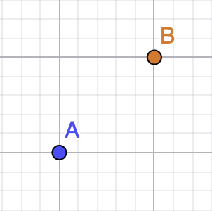
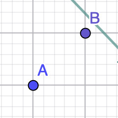
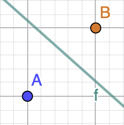
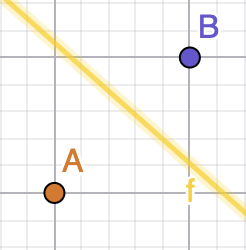
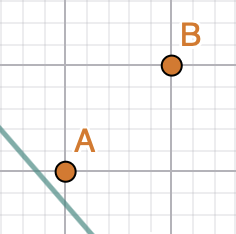
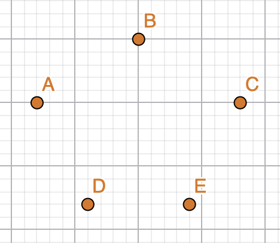
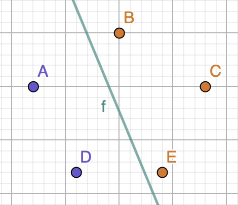
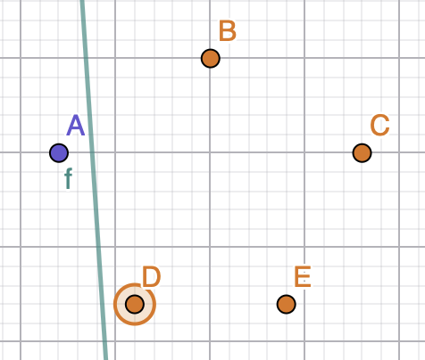
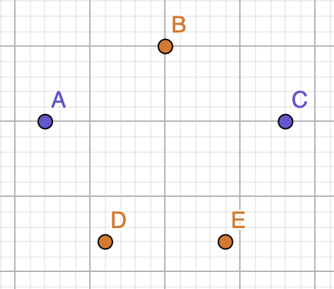

## Effective binary separating lines
Effective binary separating lines are all possible hyperplanes that classify data using two labels how many of them can separate 5 points (like in a pentagon)?
## Simplest example: Two data points
If we have two data points arranged as follows,



there are four effective binary separating lines, as shown below.
<p align="center">
  
  
  
  
</p>
Notice that different colors represent different labels, while lines represent hyperplanes that classify the data (these could be SVM or FF Network).

### General Form of a Hyperplane
In $\mathbb{R}^2$, a separating hyperplane can be written as
```math
w^T x + b = 0
```
where
```math
w =\begin{bmatrix}w_1\\w_2\end{bmatrix}\neq 0, \qquad b \in \mathbb{R}.
```
This hyperplane partitions the space into two half-spaces:
```math
w^T x + b > 0 \qquad \text{(label +1)}
```
and
```math
w^T x + b < 0 \qquad \text{(label -1)}
```
### Key Observations
* There are infinitely many effective separating lines, not only four.
* The four separators shown above are only representative examples.
* Any hyperplane that places the two points on opposite sides correctly classifies the data.
* In higher dimensions, separating boundaries are hyperplanes of dimension $d-1$ in $\mathbb{R}^d$.
When the data is linearly separable, there are infinitely many hyperplanes that classify very well. Effective binary separating lines partition the input space into two regions, assigning each region to one of the two labels.

## Five data points
If we have 5 points distributed as follows


There are cases where the points are separated by hyperplanes, such as
<p align="center">
  
  
</p>
We know that there can be at most $2^5=32$ effective separating lines for the 5 points, but there are cases where the points cannot have certain labels (because they aren't linearly separable), like this



When A, C are of one label and B, D, E are of the other one. The case where the points take the opposite labels also applies. 
Following this logic, we have 5 similar graphs with the same characteristics; therefore, there are 10 cases where no effective separating line exists.

Finally, we conclude that there are 22 effective binary separating lines.