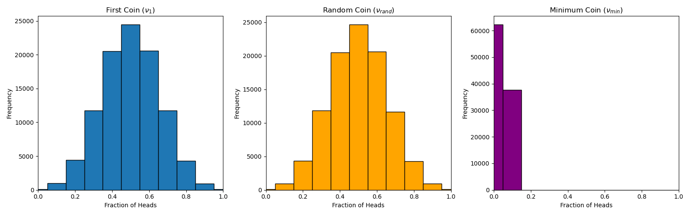
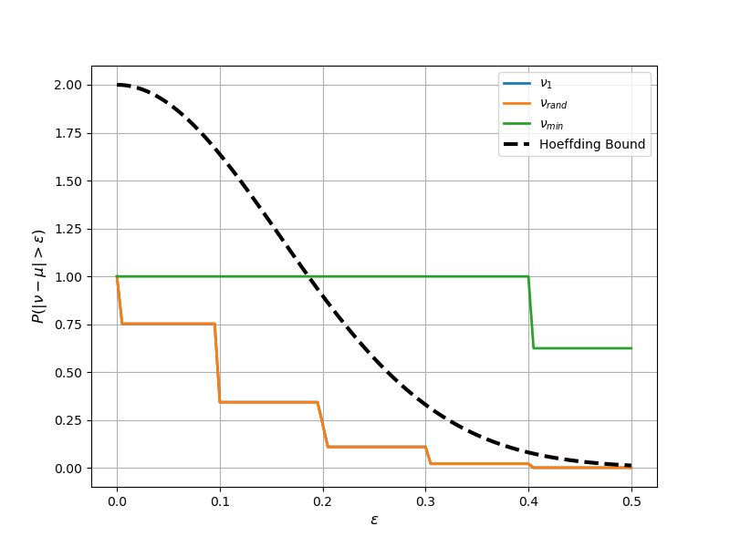

## Hoeffding's inequality
We want to perform an experiment to show that Hoeffding's inequality does not hold in certain cases. Here is the Hoeffding's inequality:
```math
  \mathbb{P}(|\nu-\mu| ≥ \epsilon) ≤ 2e^{-2N\epsilon^{2}}
```
where
* $\nu$ is the empirical mean 
* $\mu$ is the expected mean of the variale
* $N$ is the number of independent observations
* $\epsilon$ is the maximum allowed deviation between the empirical and expected means

This inequality holds only when certain assumptions are met, including that the random variable being analyzed is fixed before the observations are made.

## Description of the experiment
The experiment consists of repeatedly flipping a large number of fair coins and comparing the empirical frequencies of three different coins. 
The procedure is as follows:
1. Consider 1,000 fair coins
2. Flip each coin 10 independent times
3. From the 1,000 coins, select the following three coins:
- $C_1:$ the first coin
- $C_{rand}:$ a coin selected uniformly at random
- $C_{min}:$ the coin with the smallest fraction of heads (if several coins tie, choose the first one)
4. For each selected coin, compute the fraction of heads where $\nu$ represents the empirical probability of obtaining heads
  
```math
  \nu=\frac{\text{Number of Heads}}{10}
```

According to the experiment, we have to answer the next points

### (a) What is $\mu$ for the three coins selected?
All 1,000 coins are assumed fair, the probability of obtaining heads is
```math
  \mu=\mathbb{P}(\text{heads})=0.5
```
The expected value is the same for all three coins

### (b) Perform the experiment independently 100,000 times
We can define $\nu$ for each coin in the experiment such that
* $\nu_{1}$ is the empirical mean of the coin $C_1$
* $\nu_{rand}$ is the empirical mean of the coin $C_{rand}$
* $\nu_{min}$ is the empirical mean of the coin $C_{min}$

we use the following code to simulate the experiment and find the results
```python
import numpy as np
import matplotlib.pyplot as plt

#parameters
num_coins = 1000 #num of coins
num_flips = 10 #num of flips per coin
num_exp = 100000 #num of independent experiments

#variables to store empirical mean
v1 = []
vrand = []
vmin = []

for _ in range(num_exp):
    #0 = Tails
    #1 = Heads
    flips = np.random.randint(0, 2, size=(num_coins, num_flips))

    # Num of heads obtained by each coin
    heads = np.sum(flips, axis=1)

    # Fraction of heads for every coin
    frequencies = heads / num_flips

    # First coin
    v1.append(frequencies[0])

    # Randomly selected coin
    random_index = np.random.randint(num_coins)
    vrand.append(frequencies[random_index])

    # Coin with the minimum fraction of heads
    vmin.append(np.min(frequencies))

v1 = np.array(v1)
vrand = np.array(vrand)
vmin = np.array(vmin)

bins = np.arange(-0.05, 1.15, 0.1)
fig, axes = plt.subplots(1, 3, figsize=(16, 5))

#first coin
axes[0].hist(v1, bins=bins, edgecolor='black')
axes[0].set_title(r'First Coin ($\nu_1$)')
axes[0].set_xlabel('Fraction of Heads')
axes[0].set_ylabel('Frequency')
axes[0].set_xlim(0, 1)

#random coin
axes[1].hist(vrand, bins=bins, edgecolor='black')
axes[1].set_title(r'Random Coin ($\nu_{rand}$)')
axes[1].set_xlabel('Fraction of Heads')
axes[1].set_ylabel('Frequency')
axes[1].set_xlim(0, 1)

#minimum coin
axes[2].hist(vmin, bins=bins, edgecolor='black')
axes[2].set_title(r'Minimum Coin ($\nu_{min}$)')
axes[2].set_xlabel('Fraction of Heads')
axes[2].set_ylabel('Frequency')
axes[2].set_xlim(0, 1)

plt.tight_layout()
plt.show()

print("Average fraction of heads:")
print(f"First coin   : {np.mean(v1):.4f}")
print(f"Random coin  : {np.mean(vrand):.4f}")
print(f"Minimum coin : {np.mean(vmin):.4f}")
```
If we run it, we get the values of the empirical risk of each coin and its histograms of distributions. Let's see the results of the experiment  


### (c) Estimate $\mathbb{P}(∣\nu−\mu∣>\epsilon)$, and plot the estimates along with Hoeffding's bound $2e^{−2\epsilon^{2}N}$ on the same graph
For several values of $\epsilon$, estimate experimentally the probability
```math
\mathbb{P}(∣\nu−mu∣≥\epsilon)
```
for each selected coin.

Then compare the experimental probability with Hoeffding's bound
```math
\mathbb{P}(∣\nu−\mu∣>\epsilon)≤2e^{−2\epsilon^{2}N}
```
where $N=10$.

Adding this code to the previous code, we make the comparison of whether the empirical results satisfy the theoretical bound.
```python
#estimate P(|nu-mu|>=epsilon)
MU = 0.5
epsilons = np.linspace(0, 0.5, 101)

p_v1 = []
p_vrand = []
p_vmin = []

for eps in epsilons:
    p_v1.append(np.mean(np.abs(v1 - MU) >= eps))
    p_vrand.append(np.mean(np.abs(vrand - MU) >= eps))
    p_vmin.append(np.mean(np.abs(vmin - MU) >= eps))

p_v1 = np.array(p_v1)
p_vrand = np.array(p_vrand)
p_vmin = np.array(p_vmin)

#Hoeffding bound
hoeffding = 2 * np.exp(-2 * num_flips * epsilons**2)

#plot Hoeffding comparison
plt.figure(figsize=(8,6))

plt.plot(
    epsilons,
    p_v1,
    linewidth=2,
    label=r"$\nu_1$"
)

plt.plot(
    epsilons,
    p_vrand,
    linewidth=2,
    label=r"$\nu_{rand}$"
)

plt.plot(
    epsilons,
    p_vmin,
    linewidth=2,
    label=r"$\nu_{min}$"
)

plt.plot(
    epsilons,
    hoeffding,
    "k--",
    linewidth=3,
    label="Hoeffding Bound"
)

plt.xlabel(r"$\epsilon$", fontsize=12)
plt.ylabel(r"$P(|\nu-\mu|>\epsilon)$", fontsize=12)
plt.grid(True)
plt.legend()

plt.show()
```
We get the plot of the empirical results compared with the theoretical upper bound provided by Hoeffding's inequality.


### (d) Which coins satisfy Hoeffding's inequality?
The results show that the curves corresponding to the first coin $C_1$ and the randomly selected coin $C_{rand}$ remain below Hoeffding's bound for all tested values of $\epsilon$, so the inequality holds for these two coins. The curve corresponding to the minimum coin $C_{min}$ exceeds the theoretical bound over part of the range of $\epsilon$. This occurs because $C_{min}$ is selected after observing the outcomes of all 1,000 coins, ***introducing a selection bias that violates the assumptions of Hoeffding's inequality***.

### (e) Relate this experiment to the multiple bins problem
This *experiment illustrates the multiple bins (or multiple hypothesis) problem*.

Each coin can be viewed as a separate hypothesis. If only one coin is analyzed, Hoeffding's inequality provides a valid probabilistic guarantee. However, ***when many coins are examined simultaneously and the one with the most extreme outcome is selected, the probability of observing a large deviation increases significantly***. This phenomenon is analogous to machine learning, where many hypotheses are evaluated and the one with the lowest training error is selected. The **selected hypothesis may appear to perform exceptionally well simply due to random chance, rather than because it truly generalizes better**.