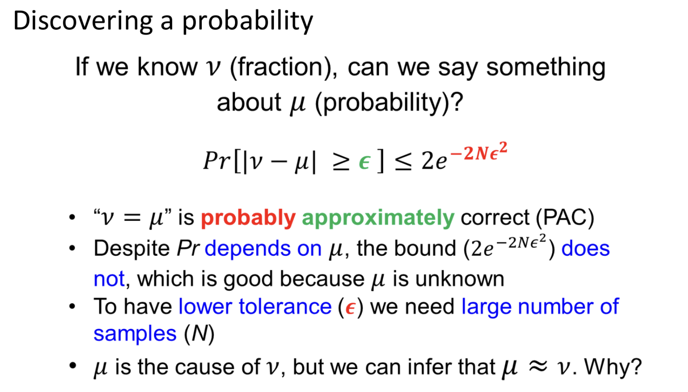

## Inequalities learning slide 29/30
We had a class where we talked about the Hoeffding inequality and PAC to analyze ML algorithms where this question arised:


We must consider Hoeffding's inequality defined such that
```math
  \mathbb{P}(|\nu-\mu| ≥ \epsilon) ≤ 2Me^{-2N\epsilon^{2}}
```
We defined, $\nu$ as the model's error on the training data, sometimes written as $E_{in}$. And, $\mu$ as the model's true error on new data, usually written as $E_{out}$. In this case, we take hypothesis set size $M=1$. So, we get
```math
  \mathbb{P}(|\nu-\mu| ≥ \epsilon) ≤ 2e^{-2N\epsilon^{2}}
```
If $N$ is sufficiently large, then $\epsilon$ is very small and the exponent $-2N\epsilon^{2}$ becomes very negative; therefore,
```math
  e^{−2N\epsilon^{2}} \rightarrow 0
```
Then,
```math
  2e^{−2N\epsilon^{2}} \rightarrow 0
```
and we obtain
```math
  \mathbb{P}(|\nu-\mu| < \epsilon) \geq 1 - 2e^{−2N\epsilon^{2}} \rightarrow 1
```
Thus, with high probability, we have
```math
  |\nu-\mu| < \epsilon
```
That is,
```math
  \mu \approx \nu
```
Hoeffding's inequality allows us to reverse the reasoning and use the observable quantity $\nu$ to infer the unknown quantity $\mu$. This is precisely the idea behind PAC learning.

Although the true error $\mu$ is unknown (and it determines the model's future behavior), we can estimate it using the observed error $\nu$, because Hoeffding guarantees that, **with sufficient data, the two will be approximately equal with high probability**.

