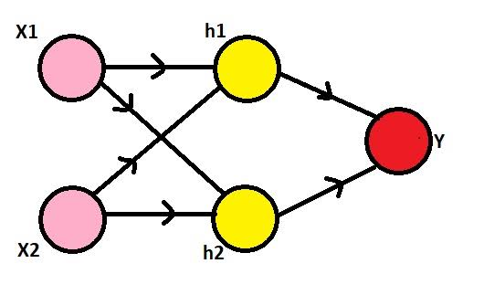

## Modeling XOR with Perceptrons
Then, We are going to explain what the network architecture of the logic gate might look like. Finally, we model XOR using perceptrons.

## XOR Function
The XOR logic gate outputs **1** if and only if its two inputs are different.

### Truth Table

<div align="center">
           
| x₁ | x₂ | XOR |
|:--:|:--:|:---:|
| 0 | 0 | 0 |
| 0 | 1 | 1 |
| 1 | 0 | 1 |
| 1 | 1 | 0 |

</div>

The logical expression of XOR can be seen as
```math
XOR(x_1,x_2)= (x_1 \land \neg x_2)\lor(\neg x_1\land x_2)
```

## Can single perceptron solve XOR?
A perceptron computes
```math
y=f(w_1x_1+w_2x_2+b)
```
wheres

- $w_1,w_2$ are the weights
- $b$ is the bias
- $f(\cdot)$ is the step activation function

A single perceptron creates a linear decision boundary, while the XOR function is not linearly separable. So, a single perceptron cannot correctly classify all XOR inputs. To model XOR, a multilayer perceptron with one hidden layer is required.

## XOR Network Architecture
The network consists of

- Two input 
- Two hidden perceptrons
- One output 



### Hidden Perceptron 1
First hidden neuron computes
```math
H_1=x_1\land\neg x_2
```
Weights and bias:

- $w_1$=1
- $w_2$=-1
- $b$=-0.5

Its output is
```math
H_1=f(x_1-x_2-0.5)
```

#### Verification

<div align="center">
           
| x₁ | x₂ | z | H₁ |
|:--:|:--:|:--:|:--:|
|0|0|-0.5|0|
|0|1|-1.5|0|
|1|0|0.5|1|
|1|1|-0.5|0|

</div>

# Hidden Perceptron 2
Second hidden neuron computes
```math
H_2=\neg x_1\land x_2
```
Weights and bias:

- $w_1$=-1
- $w_2$=1
- $b$=-0.5

Its output is
```math
H_2=f(-x_1+x_2-0.5)
```

#### Verification

<div align="center">
           
| x₁ | x₂ | z | H₂ |
|:--:|:--:|:--:|:--:|
|0|0|-0.5|0|
|0|1|0.5|1|
|1|0|-1.5|0|
|1|1|-0.5|0|

</div>

# Complete Verification

<div align="center">
           
| x₁ | x₂ | H₁ | H₂ | Output |
|:--:|:--:|:--:|:--:|:------:|
|0|0|0|0|0|
|0|1|0|1|1|
|1|0|1|0|1|
|1|1|0|0|0|

</div>